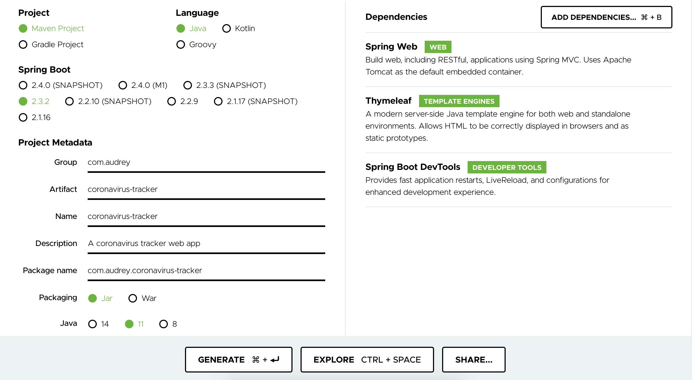

# Corona virus Tracking Web App

## Source
This app was developed based on this tutorial https://www.youtube.com/watch?v=8hjNG9GZGnQ by Java Brains.

## How to set up
1. Go to https://start.spring.io/
2. Fill in the metadata and set the dependencies, then generate the project.

3. Unzip the downloaded zip file.
4. Start IntelliJ.
5. Click on Import or Open.
6. Open the unzipped folder.
