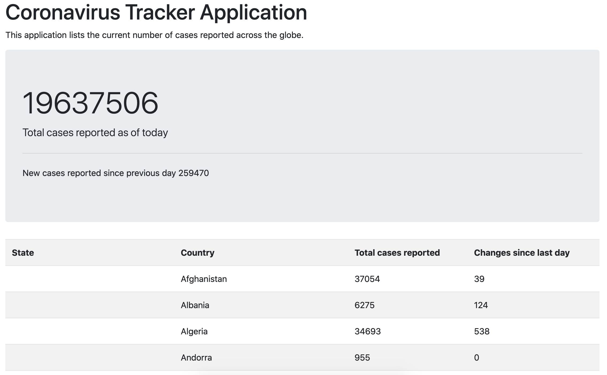

# Corona virus Tracking Web App

## Deployed App
The app is deployed on [Heroku](https://coronavirus-tracker-web-app.herokuapp.com/).

## Source
This app was developed based on a combination of tutorials:
 - getting live data to populate a table: [Tutorial by Java Brains](https://www.youtube.com/watch?v=8hjNG9GZGnQ)
 - adding summary cards: [Code by adrianhajdin](https://github.com/adrianhajdin/project_corona_tracker)
 - adding graph: [Code by packetcode](https://github.com/packetcode/corona-tracker-india/blob/master/index.html)
